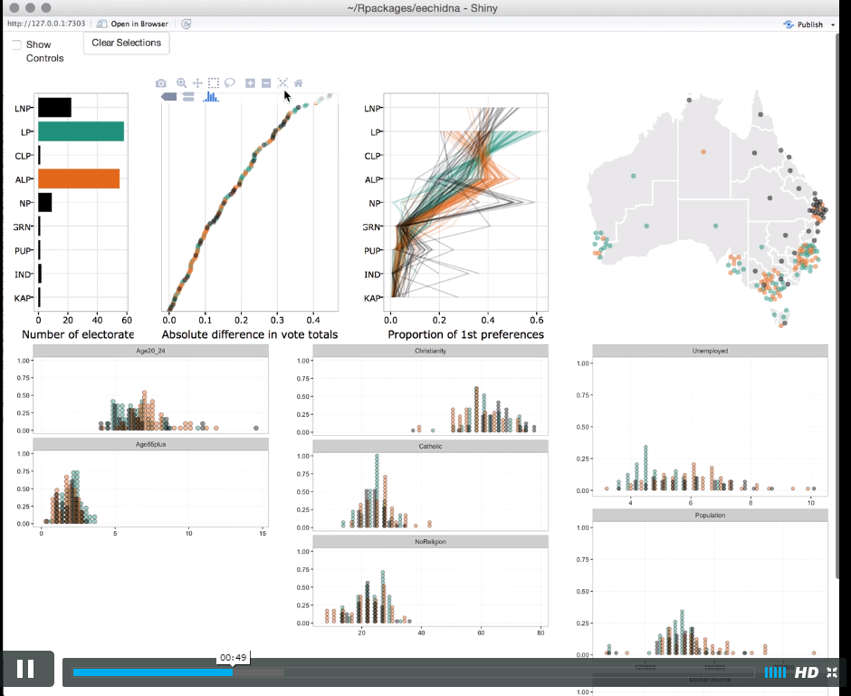

<!-- README.md is generated from README.Rmd. Please edit that file -->

```{r, echo = FALSE}
knitr::opts_chunk$set(
  collapse = TRUE,
  comment = "#>",
  fig.path = "README-"
)
```


# eechidna
[](https://travis-ci.org/ropenscilabs/eechidna) [](https://ci.appveyor.com/project/ropenscilabs/eechidna) [](http://cran.r-project.org/package=eechidna) [](http://cran.rstudio.com/web/packages/eechidna/index.html)

## Exploring Election and Census Highly Informative Data Nationally for Australia

The R package *eechidna* provides data from the 2013 Australian Federal Election and 2011 Australian Census for each House of Representatives electorate, along with some tools for visualizing and analysing the data. 

This package was developed during the [rOpenSci auunconf event](http://auunconf.ropensci.org/) in Brisbane, Queensland, during 21-22 April 2016. [Peter Ellis'](https://github.com/ellisp/) work on the NZ electoral data was an important inspiration for this package.

## How to install

You can install the latest release of the package from CRAN like this

```{r eval = FALSE}
install.packages("eechidna")
```

Or you can install the development version from github, which may have some changes that are not yet on CRAN, using `devtools`, like this:

```{r eval = FALSE}
devtools::install_github("ropenscilabs/eechidna", 
                         build_vignettes = TRUE)
library(eechidna)
```

## How to use

The most accessible and impressive part of this package is a highly interactive web app for exploring the election and census data together. This app uses the shiny framework, and can be run locally on your computer with the command `eechidna::launchApp()`. There is a video demo of the app here: <https://vimeo.com/167367369>, here's a screenshot:



In addition to the app, the package consists of several datasets, including the 2011 Australian Census, the 2013 Australian Federal Election (House of Representatives), and shapefiles for all Australian electoral districts. 

We have two vignettes that show how to access these data in the package, and demonstrate how to analyse the data using R:  

- [Exploring the 2013 Election data](https://cran.r-project.org/web/packages/eechidna/vignettes/exploring-election-data.html)      
- [Exploring the 2011 Census data] (https://cran.r-project.org/web/packages/eechidna/vignettes/exploring-census-data.html) 

There are also two vignettes that demonstrate how to use the spatial data to make maps. Mapping election data for Australia is not trivial because of the extreme variation in electorate size. In these vignettes we show some methods for effectively visualising election data in Australia:

- [Mapping Australia's Electorates](https://cran.r-project.org/web/packages/eechidna/vignettes/plotting-electorates.html)     
- [Plotting Australia's Polling Stations](https://cran.r-project.org/web/packages/eechidna/vignettes/plotting-polling-stns.html)         
- [Getting Oz Electorate shapefiles into shape](https://cran.r-project.org/web/packages/eechidna/vignettes/getting-ozShapefiles.html)

## License

This package is free and open source software, licensed under GPL (>= 2).

## Feedback, contributing, etc.

Please open and issue if you find something that doesn't work as expected or have questions or suggestions. Note that this project is released with a [Guide to Contributing](CONTRIBUTING.md) and a [Contributor Code of Conduct](CONDUCT.md). By participating in this project you agree to abide by its terms.

## Acknoweldgements 

Thanks to Xiaoyue Cheng for her [cartogram](https://github.com/chxy/cartogram) package which supplies the Dorling algorithm for this package. Thanks also to Andy Teucher for his [rmapshaper](https://github.com/ateucher/rmapshaper) package which has some key functions for working with shapefiles. Thanks to Scott Chamberlain and Yihui Xie for help with troubleshooting. 

---
[](http://ropensci.org)
