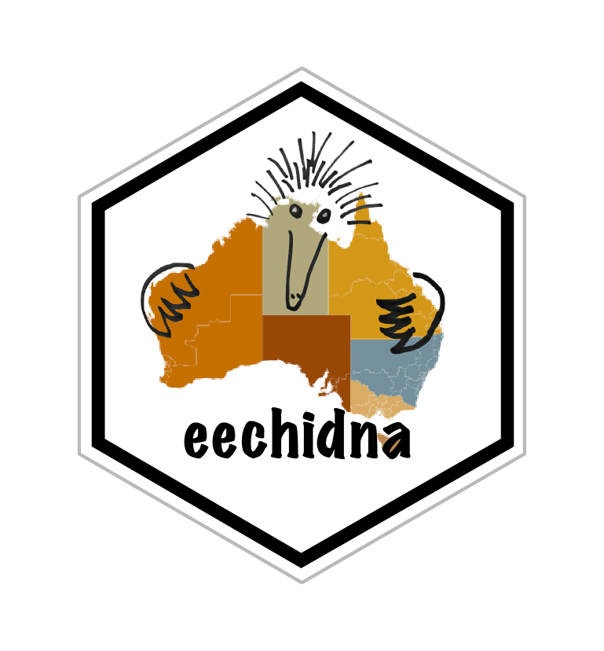

<!-- README.md is generated from README.Rmd. Please edit that file -->

# eechidna 

[](http://cran.r-project.org/package=eechidna)
[](http://cran.rstudio.com/web/packages/eechidna/index.html)
[](https://travis-ci.com/github/jforbes14/eechidna)
[](https://ci.appveyor.com/project/jforbes14/eechidna)

## Exploring Election and Census Highly Informative Data Nationally for Australia

The R package *eechidna* provides data from the Australian Federal
elections in 2001, 2004, 2007, 2010, 2013, 2016 and 2019, along with the
Australian Census information for each House of Representatives
electorate from the 2001, 2006, 2011 and 2016 Censuses. Additionally,
Census information is imputed for electorates in years 2004, 2007, 2010,
2013 and 2019. It also includes tools for visualizing and analysing the
data.

This package was developed during the [rOpenSci auunconf
event](http://auunconf.ropensci.org/) in Brisbane, Queensland, during
21-22 April 2016. It has been updated many times since to include
election and Census information for 2001, 2011 and 2019. [Peter
Ellis’](https://github.com/ellisp/) work on the NZ electoral data was an
important inspiration for this package.

## How to install

You can install the latest release of the package from CRAN like this

``` r
install.packages("eechidna")
```

Or you can install the development version from github, which may have
some changes that are not yet on CRAN, using `devtools`, like this:

``` r
devtools::install_github("jforbes14/eechidna", 
                         build_vignettes = TRUE)
library(eechidna)
```

If you are using Linux, you may need some additional libraries for the
mapping functions, you can get these with this line:

    apt-get install libgdal-dev libgeos-dev -y

## How to use

The package consists of several datasets, which includes Australian
Census data at electorate level, Australian Federal election (House of
Representatives) voting data from electorates and polling booths, and
shapefiles for Australian electoral districts at various points in time.
In addition to the data provided, `eechidna` includes a highly
interactive web app for exploring the election and census data together.
This app uses the shiny framework, and can be run locally on your
computer with the command `eechidna::launchApp()`. There is a video demo
of the app here: <https://vimeo.com/167367369>.

We have many vignettes that show how to access these data in the
package, and demonstrate how to analyse the data using R. These can be
found in the *articles* tab at the top of this page.

- [An introduction to
  eechidna](https://jforbes14.github.io/eechidna/articles/eechidna-intro.html):
  an overview of the package contents and examples of how to use the
  data.

- [Exploring election
  data](https://jforbes14.github.io/eechidna/articles/exploring-election-data.html):
  examples of wrangling data from the 2016 Federal election data to gain
  insights.

- [Exploring Census
  data](https://jforbes14.github.io/eechidna/articles/exploring-census-data.html):
  visualizing 2016 Census data to analyse patterns in electoral
  population characteristics.

There are also three vignettes that demonstrate how to use the spatial
data to make maps. Mapping election data for Australia is not trivial
because of the extreme variation in electorate size. In these vignettes
we show some methods for effectively visualizing election data in
Australia. These too are found in the *articles* tab at the top of this
page.

- [Mapping federal
  electorates](https://jforbes14.github.io/eechidna/articles/plotting-electorates.html):
  how to plot a map of Australian federal electorates, and how to better
  visualize electoral voting data using a cartogram.

- [Mapping polling
  booths](https://jforbes14.github.io/eechidna/articles/plotting-polling-stns.html):
  examples of how to plot the polling booth locations and associated
  voting data.

- [Getting Australian electoral
  maps](https://jforbes14.github.io/eechidna/articles/getting-ozShapefiles.html):
  details the process to produce usable electoral maps from the original
  shapefiles.

Additionally, there is a vignette on how we have imputed electoral
Census data in election years for which a Census does not exactly align.

- [Imputing Census data for non-Census
  years](https://jforbes14.github.io/eechidna/articles/imputing-census-data.html):
  details the procedure used to impute Census data for 2004, 2007, 2010,
  2013 and 2019.

## License

This package is free and open source software, licensed under GPL (\>=
2).

## Feedback, contributing, etc.

Please open an issue if you find something that doesn’t work as expected
or have questions or suggestions. Note that this project is released
with a [Guide to Contributing](CONTRIBUTING.md) and a [Contributor Code
of Conduct](CONDUCT.md). By participating in this project you agree to
abide by its terms.

## Acknowledgements

Thanks to Xiaoyue Cheng for her
[cartogram](https://github.com/chxy/cartogram) package which supplies
the Dorling algorithm for this package. Thanks also to Roger Bivand for
his `rgdal` and `rgeos` packages which has some key functions for
working with shapefiles. Thanks to Scott Chamberlain and Yihui Xie for
help with troubleshooting.
